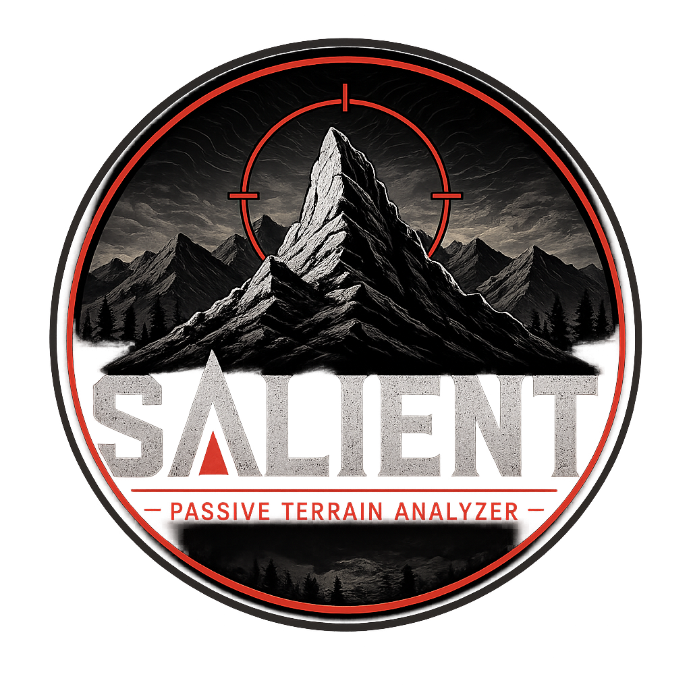

# Salient



**A desktop operator console for passive terrain analysis on Security Onion grids.**

Salient connects read-only to Elasticsearch, aggregates existing Zeek telemetry,
and turns observed traffic into a scored dependency graph and ranked key-terrain
report with the evidence behind each ranking. It is built for hunting teams that
are new to an environment and need to understand its key systems and dependencies
without active scanning or changes to the Security Onion deployment.

The map is a criticality view of that observed dependency terrain, not a network
diagram. Node size and heat emphasize the systems whose compromise or loss would
matter most. The declared-device topology layout remains available as an optional
cross-check; it is not the product's primary view.

The desktop console is the primary interface. It connects to the grid, runs scans
with live progress, browses saved snapshots, investigates role evidence, and
exports maps from one native window on Linux, macOS, or Windows.

Release history is tracked in [CHANGELOG.md](CHANGELOG.md).

## Operator console

The console provides:

- Elasticsearch connection with API key, CA certificate, custom field map, and
  explicit insecure-TLS controls.
- Automatic grid discovery at connect: observed datasets, missing-dataset
  warnings (conn is required), and sensors, in the task log.
- Configurable scan window, scope CIDRs, and timezone.
- Live scan progress and cancellation.
- A Key Terrain drawer leading with the ranked systems and their score-driver evidence.
- Criticality maps grouped by subnet, sized and heated by terrain score, with
  observed or inferred gateways.
- Grid and organic layouts, plus an optional declared-device topology cross-check.
- Snapshot browsing and offline map reconstruction.
- Aggregate drill-in: clicking an "N other hosts" node opens a filterable list
  of every collapsed host with its rank, role, services, device, MAC, and
  vendor. Right-click any row to assign it to a device or correct its role, and
  use **Suggest tags for listed hosts** to AI-tag just the filtered set, or
  **Pin to map** to promote a collapsed host to its own node.
- Per-host service lists derived from observed responder ports (~110 recognized
  services): the full Active Directory protocol set plus network-vendor
  protocols for UniFi, Cisco, Aruba, Meraki, and Juniper gear.
- Network-gear detection: hosts serving controller/switch/AP-only protocols
  (CAPWAP, Aruba PAPI, Cisco Smart Install, TACACS+) are typed as NetworkGear
  and promoted to the core tier.
- Per-node MAC and OUI vendor: each host shows its observed responder MAC and
  the vendor decoded from it (gateway MACs are excluded so a router's MAC is
  never mis-attributed to the hosts behind it). Shared-MAC same-device hints
  complement the hostname-based ones.
- Device identity: link multiple IPs (for example one router across several
  VLANs) into one named device with type and notes; linked nodes get a shared
  badge and a device card. Hostname- and MAC-based same-device hints suggest
  links; the operator confirms or dismisses.
- Role correction: right-click **Set role…** overrides a wrong inference with
  any text; the correction is marked ✎, the original inference stays visible,
  and known roles also move the node to the correct map tier.
- Drift comparison: pick any older snapshot as a baseline and see what
  appeared, vanished, or changed rank since — including new DNS/DHCP/auth/
  file/database providers at any terrain rank, not just newcomers to the top.
  Edges carry a service-evidence level (protocol-confirmed, responder-
  confirmed, or port-only); port-only connection attempts never influence
  rankings or roles.
- Asset reconciliation: load an inventory CSV and see undocumented hosts,
  documented-but-silent assets, and role contradictions flagged on the map.
- Optional model-assisted device tags based on observed network communication,
  grounded in operator-confirmed device names, roles, and labels; suggestions
  can be accepted into durable labels or dismissed permanently.
- Search by IP, hostname, role, service, device name, or label.
- Node evidence and right-click actions for copying, focusing, assigning to a
  device, and correcting roles.
- PNG export of the exact on-screen layout, plus self-contained HTML and GraphML.

Elasticsearch and model API keys remain in memory and are never written to
disk. Operator annotations (devices, labels, role overrides) persist in
`salient-data/devices.json` and survive rescans.

## Key-terrain scoring

Salient ranks key terrain from observed dependency traffic, not labels or icon
size. Each rank is a composite score:

- **40% critical-service dependents:** distinct hosts depending on this node for
  auth, DNS/name resolution, file, or database services.
- **25% PageRank:** dependency centrality in the weighted traffic graph; auth
  and DNS/name-resolution edges count 3×.
- **20% betweenness:** chokepoint value — how often dependency paths pass
  through the node.
- **15% subnet spread:** how many client subnets depend on the node.

Scores are min-max normalized within the snapshot and ranked descending; invalid
terrain artifacts such as multicast, broadcast, loopback, and link-local
addresses are excluded from the composite. The console's **Key Terrain** button
shows the top ranked visible hosts/devices and opens a drawer that can zoom to
the selected node. Collapsed device nodes inherit their strongest member rank.

## Build and run

Prerequisites:

- Git
- Make
- Go 1.26.4 or newer
- Node.js and npm

Linux also needs the native webview development packages:

~~~sh
# Debian/Ubuntu
sudo apt-get install libwebkit2gtk-4.1-dev libgtk-3-dev

# Fedora/RHEL/Rocky
sudo dnf install webkit2gtk4.1-devel gtk3-devel
~~~

Clone, download the pinned dependencies, and build:

~~~sh
git clone https://github.com/BushidoCyb3r/salient.git
cd salient
make gui-deps
make gui
~~~

Launch the resulting application:

~~~sh
# Linux
./gui/build/bin/gui

# macOS
open gui/build/bin/gui.app

# Windows PowerShell
.\gui\build\bin\gui.exe
~~~

Platform-specific runtime packages and unsigned-build warnings are documented in
[docs/GUI.md](docs/GUI.md).

## First connection

1. Create a read-only Elasticsearch API key. In Kibana, go to **Stack
   Management → Security → API keys → Create API key**, name it, toggle
   **Control security privileges** on, and replace the editor contents with:

   ```json
   {
     "salient_ro": {
       "cluster": ["monitor"],
       "indices": [
         {
           "names": ["logs-*"],
           "privileges": ["read", "view_index_metadata"]
         }
       ]
     }
   }
   ```

   The `cluster: ["monitor"]` privilege is required — Salient calls the
   Elasticsearch root `info` API at connect, and without it the grid returns
   `action [cluster:monitor/main] is unauthorized ... HTTP 403`. Create the key,
   then copy its **Base64 ("encoded")** value for the connect form. Full steps
   (firewall, TLS, Dev Tools alternative) are in
   [docs/DEPLOYMENT.md](docs/DEPLOYMENT.md).
2. Launch the console and enter the manager URL, API key, and CA certificate.
3. Set the analysis window, timezone, and optional scope CIDRs.
4. Connect. The task log immediately shows what the grid holds: observed
   datasets with counts, warnings for missing ones (conn is required), and
   sensors — verify coverage before spending a scan window.
5. Select **Run Scan**.
6. Select the completed snapshot to inspect and export its map.
7. Optionally configure **AI Device Tagging** and select **Suggest Tags** to add
   communication-based labels to visible devices.

The default Security Onion field map is an unverified starting point because Zeek
to ECS mappings vary by deployment and release. Verify it against the target grid
and record the result in [docs/FIELDMAP.md](docs/FIELDMAP.md) before trusting scan
output. A wrong field map can produce incomplete terrain.

## What a scan produces

Salient performs server-side Elasticsearch aggregations rather than downloading
raw events. A completed scan writes:

- A compressed snapshot containing scored nodes, dependencies, evidence, and
  observation metadata.
- A detailed analyst report.
- A self-contained interactive briefing map.
- An optional protected `.tags.json` sidecar containing validated model
  suggestions when device tagging is used.

Artifacts are stored under salient-data/snapshots, salient-data/reports, and
salient-data/maps. The console can reopen snapshots without reconnecting to the
grid.

Large unfocused maps are condensed into a **segment-flow overview**: every real
VLAN gets its own box showing its top hosts (the rest behind an "N more hosts"
chip), with dependencies bundled between segments. This is intentional, not a
complete-topology view. **Click a VLAN box (▸) to drill into a full-detail view
of that segment**, then "← overview" to return; clicking an "N more hosts" chip
opens the full host list behind it. See [docs/MAPS.md](docs/MAPS.md) for the
full model.

## Console workflows

### Inspecting hosts

Click any node for its evidence: role (with the operator correction and the
original inference when overridden), rank, composite score, device, labels,
observed services, MAC and vendor, and the raw evidence strings behind each
role. Click an aggregate "N other hosts" node to open the host-list panel —
type to filter by IP, hostname, role, service, device, MAC, or vendor; click a
row for its evidence, or right-click it to assign a device or set a role.
Aggregated hosts are full participants: **Suggest tags for listed hosts** runs
AI tagging over the currently-filtered set (up to 100 at a time), and
right-click **Pin to map** promotes any collapsed host to its own node.

### Showing every private host

Condensed maps keep only top-ranked hosts. The **show all private hosts**
checkbox (map controls) instead promotes every RFC1918 (private) host to its own
node while external peers still collapse into one box — a fuller, more accurate
picture on grids with a manageable internal host count. A cap
(`config.MapAllPrivateCap`, 1500) bounds it: past that, the highest-ranked
private hosts are shown and the rest re-aggregate, with a finding noting the
count so a very large grid can't produce an unrenderable map. The setting
persists in the device registry.

### Pinning a host onto the map

Condensed briefing maps keep only the top-ranked hosts and collapse the rest
into "N other hosts" aggregates. To force a specific host to always show as its
own node — a low-traffic but important box you want to watch — right-click it
(on the map or in a host-list row) → **Pin to map**. Pinned nodes get an amber
border and are retained additively (they show even if that pushes the map past
its element target). **Unpin from map** returns the host to its aggregate. Pins
persist in the device registry.

### Linking IPs into devices

A router with an interface per VLAN appears as several unrelated nodes. To
merge their identity: right-click the first IP → **Assign to device…** → type a
name and press Enter. Right-click the remaining IPs → **Assign to device…** →
pick the existing name. Linked nodes get a violet badge and the device name in
their label. The **Devices** sidebar section lists every device; click one for
its card — editable notes, member IPs (click to zoom, unlink to remove), and
delete. When the same hostname is observed on two or more IPs the Devices
section offers a one-click "same device?" hint; dismissals are remembered.

### Correcting a wrong role

Right-click the node → **Set role…** → type anything (`Camera`, `PLC`,
`Octoprint`) or pick a suggestion; Enter applies, an empty value clears. The
evidence panel shows `role: ✎ Camera (operator)` with the original inference
kept underneath — corrections never destroy observed evidence. Known role
names also move the node into the right map tier (core/service/client).

### Comparing snapshots (drift)

Load the snapshot under review, pick an older snapshot in the **Drift**
baseline dropdown, and select **Compare**. Green borders are new hosts, ghosted
dashed nodes vanished, amber rank changes; new and vanished edges recolor the
same way. The change counts print in the task log. **Clear** (or loading
another snapshot) returns to the normal view.

### Reconciling an asset inventory

Select **Load asset CSV…** in the **Reconcile** section and pick your
inventory export. The map flags observed-but-undocumented hosts (red),
documented-but-silent assets (ghosted — check sensor blind spots before
calling them decommissioned), and role contradictions (amber double border).
Segment names from the CSV label the subnet boxes. The CSV stays applied
across snapshot switches until cleared with **×**.

The CSV format is forgiving — real spreadsheet exports work as-is. Only an IP
column is required; headers are autodetected by keyword:

| Column   | Recognized header keywords                                  |
|----------|-------------------------------------------------------------|
| IP       | `ip`, `ipaddress`, `ipaddr`, `ipv4`, `ipv6`, or `address`   |
| Hostname | `host`, `name`, `fqdn`, `asset`, `system`, `device`         |
| Role     | `role`, `function`, `type`, `purpose`, `service`, `description` |
| Segment  | `vlan`, `segment`, `subnet`, `site`, `enclave`, `zone`, `network` |

~~~csv
ip,hostname,role,segment
192.168.20.1,udm,Gateway,vlan20
10.10.40.5,nas01,FileServer,storage
~~~

Column order does not matter, extra columns are ignored, rows without a
parseable IP are skipped with a logged warning, and a headerless file still
works (the IP column is detected by content).

## Command line

The CLI remains available for automation, field discovery, static exports, drift
analysis, asset reconciliation, and optional snapshot analysis.

~~~sh
make deps
make build

export SALIENT_ES_URL="https://so-manager:9200"
export SALIENT_API_KEY="<base64 id:key>"

./bin/salient test-connection --ca-cert grid-ca.pem
./bin/salient discover --ca-cert grid-ca.pem --window 168h
./bin/salient scan --ca-cert grid-ca.pem --window 336h \
    --scope 10.0.0.0/8 --tz America/New_York
./bin/salient list
./bin/salient view
~~~

Stored snapshots can also be rendered as HTML, SVG, JSON, or GraphML; compared
with the diff command; or reconciled against an asset CSV. See
[docs/MAPS.md](docs/MAPS.md) for map interpretation and export guidance.

## Security model

- Elasticsearch access is read-only. Salient does not change grid
  configuration, indices, or documents.
- The console writes only local snapshots, reports, maps, and operator-selected
  exports.
- Runtime assets are bundled locally. There are no CDN dependencies or telemetry.
- The CLI is a static binary. The desktop console uses the operating system's
  native webview and must be built per target platform.
- Model requests are snapshot-only and send capped, summarized topology. Remote
  endpoints require HTTPS and an explicit network-data-egress acknowledgement.
- Model API keys stay in memory. Tag sidecars record only endpoint host, model,
  timestamp, and validated suggestions.
- On POSIX systems, managed artifacts use 0600 files in 0700 directories.
  Windows exports inherit the destination directory's ACLs.

Terrain artifacts expose network dependencies and critical systems. Protect them
at the classification and handling level of the network they describe.

## Limitations

- **Passive-window blindness:** only systems that communicated during the selected
  window are visible.
- **Sensor-coverage blindness:** unsensed east-west traffic is absent. Empty
  in-scope networks are possible blind spots, not proof of silence.
- **Logical, not physical topology:** maps show Layer 3 dependencies, not switches,
  cabling, ports, or silent devices.
- **Inferred gateways:** when MAC evidence is unavailable, gateway placement is
  synthesized and displayed as inferred.
- **Evidence-scored roles:** server roles are conservative hypotheses backed by
  observed behavior; uncertain nodes remain Unknown.
- **Model suggestions are not evidence:** generated device tags are displayed
  separately and must be verified by an operator.

## Model-assisted device tagging

The console can suggest device tags from communication patterns in a stored
snapshot. Select an API shape, enter the endpoint and model, provide an API key
when required, and explicitly acknowledge remote network-data egress. The key
is kept only for the in-flight request.

Supported request shapes are OpenAI-compatible chat completions, Anthropic
Messages, and Gemini GenerateContent. These cover the major hosted APIs, local
Llama servers that expose a compatible endpoint, and compatible Ask Sage
routes. GenAI.mil and other tenant-controlled services use the API shape,
endpoint, model, and credentials issued for that environment; Salient does not
assume a universal public endpoint.

Only capped node and edge summaries are sent, never raw Zeek events or
Elasticsearch credentials. The summaries include inferred roles, named services
per observed responder port, and each host's MAC and decoded vendor (snapshots
created before the expanded port table and MAC capture carry generic `port-N`
names and no vendor — rescan to give the model the richer labels). Tagging runs
either over the whole map (**Suggest Tags**) or over just the hosts listed in an
aggregate panel (**Suggest tags for listed hosts**, capped at 100 per run and
merged into the sidecar so targeted runs accumulate). Operator-confirmed facts —
device names and types, role corrections, and durable labels — ride along as
ground truth the model must not contradict; free-text device notes never leave
the host. Responses must cite existing device IDs and include tags, confidence,
and rationale. Invalid IDs or
malformed suggestions are rejected, and accepted suggestions remain separate
from observed evidence.

In the console, a node with pending suggestions shows them in its evidence
panel with two actions: **accept tags** promotes them to durable operator
labels (they survive rescans and feed future tagging runs as ground truth);
**dismiss suggestion** hides them permanently.

## Repository layout

~~~
gui/                   native desktop operator console
cmd/salient/          command-line interface
internal/scan/         shared scan pipeline used by the console and CLI
internal/escli/        read-only Elasticsearch client and field mapping
internal/graph/        dependency graph, evidence, role inference, snapshots
internal/score/        key-terrain scoring
internal/config/       every tunable threshold, port/service tables
internal/mapview/      subnet grouping, gateways, and briefing-map reduction
internal/devices/      operator device registry (links, labels, role overrides)
internal/assist/       model-assisted analysis and device tagging
internal/report/       HTML, SVG, JSON, and GraphML renderers
internal/snapshot/     snapshot storage, artifact indexing, and drift comparison
internal/reconcile/    asset-list reconciliation
web/                   embedded offline map assets
~~~

Additional operator documentation:

- [Desktop console build and QA](docs/GUI.md)
- [Read-only deployment](docs/DEPLOYMENT.md)
- [Field-map verification](docs/FIELDMAP.md)
- [Map interpretation and export](docs/MAPS.md)

## License

Salient is licensed under the [Apache License 2.0](LICENSE).

Salient uses the
[official Elasticsearch Go client](https://github.com/elastic/go-elasticsearch/blob/v8.19.6/LICENSE),
which is also licensed under Apache-2.0. Salient connects to external
Elasticsearch and Security Onion installations; those platforms remain subject
to their own licenses:

- [Elasticsearch licensing](https://www.elastic.co/licensing/elastic-license)
- [Security Onion license](https://securityonionsolutions.com/license/)
